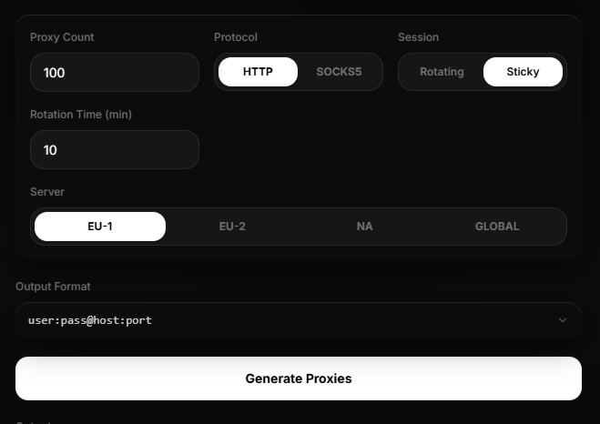
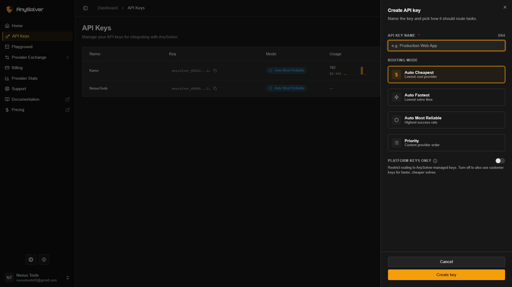
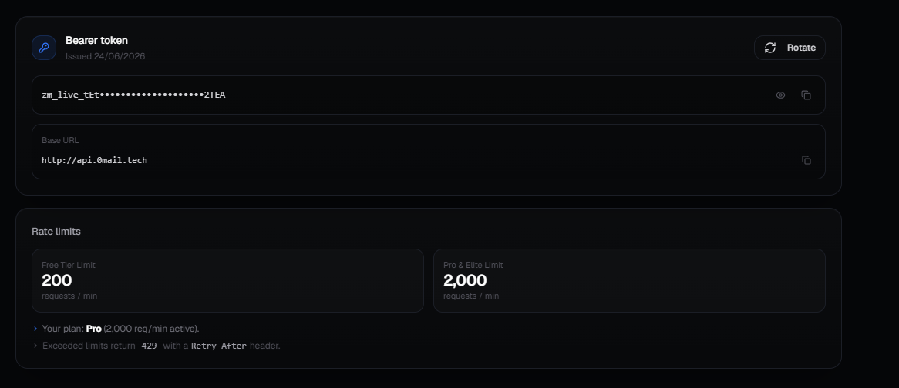

<h1>Token Generator Setup Guide</h1>

<p>A simple step-by-step guide to configure and run the Token Generator application.</p>

<hr />

<h2>📋 Prerequisites</h2>

<p>Before starting, make sure your computer has the correct environment:</p>
<ul>
  <li><strong>Python 3.12</strong> or higher installed.</li>
  <li>Make sure to check the <strong>"Add Python to PATH"</strong> box during the Python installation.</li>
</ul>

<hr />

<h2>🚀 Setup Steps</h2>

<h3>1. Install Dependencies</h3>
<p>Run the setup script in your project folder to automatically install everything needed:</p>
<pre><code>setup.bat</code></pre>

<h3>2. Configure Residential Proxies</h3>
<p>This generator requires <strong>Residential Proxies only</strong> to work properly. Use a provider like <strong>nodeproxies.xyz</strong> and make sure <strong>Sticky Sessions</strong> are turned on with at least a 10-minute rotation.</p>

<p align="left">
  
</p>

<ol>
  <li>Generate your residential proxies in this exact format: <code>user:pass@host:port</code></li>
  <li>Open the file <code>io/input/proxies.txt</code> and paste your list of residential proxies inside.</li>
</ol>

<hr />

<h2>🔑 Getting Your API Keys</h2>

<h3>3. AnySolver Key (Captcha Solver)</h3>
<ol>
  <li>Log into your account at <strong>anysolver.com</strong> and add balance.</li>
  <li>Go to the <strong>API Keys</strong> page and create a new key.</li>
</ol>

<p><strong>Note: The routing mode choice does not matter here, as the script automatically handles and overwrites it during runtime.</strong></p>

<p align="left">
  
</p>

<h3>4. ZeroMail Key (Email Verification)</h3>
<ol>
  <li>Create a free account at <strong>0mail.tech</strong> (a paid tier is only required if u want to run more then 5 threads).</li>
  <li>Navigate to the developer tab, locate the <strong>API Keys</strong> section, and copy your <strong>API KEY</strong>.</li>
</ol>

<p align="left">
  
</p>

<hr />

<h2>📢 Stay Updated</h2>

<h3>5. Join the Telegram Channel</h3>
<p>Captcha providers and sub-services change frequently. Stay updated on which subprovider is currently working by joining our Telegram channel:</p>
<p><strong><a href="https://t.me/cfvatos">t.me/cfvatos</a></strong></p>

<hr />

<h2>⚙️ Configuration & Run</h2>

<h3>6. Edit config.json</h3>
<p>Open the <code>config.json</code> file in the main folder. You need to replace the placeholder values for <strong>"api_key"</strong> (under solver) and <strong>"mail_api_key"</strong> (under verification) with your actual keys:</p>

```json
{
    "generator": {
        "thread_count": 1,
        "invite": "YOUR_INVITE_CODE_HERE",
        "custom_fingerprints": false
    },
    "solver": {
        "service": "anysolver",
        "subservice": "VoidSolver",
        "api_key": "PASTE_YOUR_ANYSOLVER_API_KEY_HERE",
        "captcha_timeout": 120
    },
    "verification": {
        "mail_verification": true,
        "mail_provider": "cybertemp",
        "mail_api_key": "PASTE_YOUR_CYBERTEMP_API_KEY_HERE",
        "phone_verification": false,
        "phone_provider": "onlinesim",
        "phone_api_key": "",
        "country_code": 212
    },
    "humanizer": {
        "enabled": false,
        "avatar": true,
        "pronouns": true,
        "bio": true,
        "display_name": true,
        "username": true
    },
    "logs": {
        "censor_token": false
    }
}
```
<p>Once configured, run the generator and you're good to go.</p>
